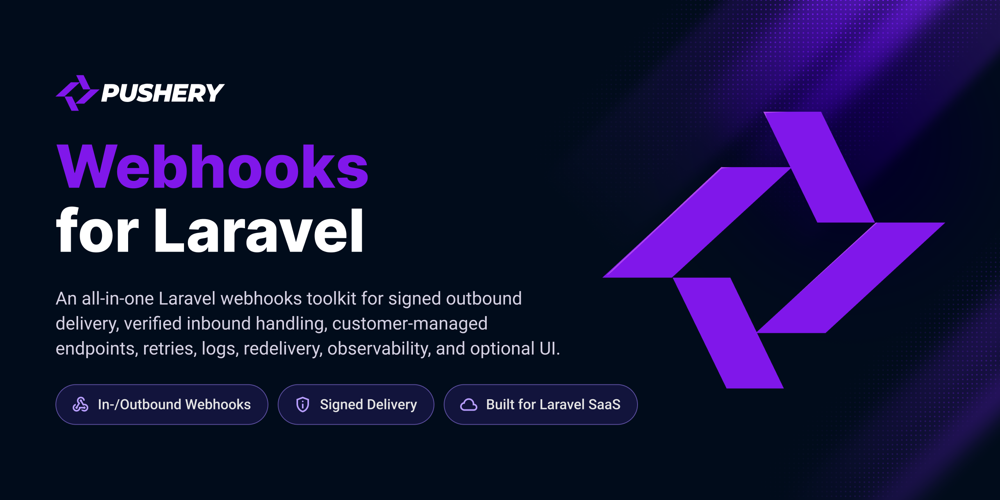

<p align="center">
  <a href="https://github.com/pushery/webhooks-for-laravel">
    
  </a>
</p>

# Webhooks for Laravel

[](https://packagist.org/packages/pushery/webhooks-for-laravel)
[](https://packagist.org/packages/pushery/webhooks-for-laravel)
[](https://phpstan.org)
[](https://laravel.com/docs/pint)
[](LICENSE)

An all-in-one, config-gated webhooks toolkit for Laravel. It **sends** signed
outbound webhooks, **receives** and verifies inbound ones, gives your customers a
**self-service** portal to manage their own endpoints, and puts an **observability**
dashboard over the whole delivery log — and you switch on only the layers you need.
Signatures are [Standard Webhooks](https://www.standardwebhooks.com) by default, so
every delivery is verifiable out of the box by any Standard Webhooks consumer in any
language. The engine is entirely in-house — no third-party webhook-engine
dependency — and its storage runs on **PostgreSQL or MySQL 8.4+** (or on no database
at all, if you only send).

## The layered architecture

The package is five layers stacked on a shared crypto/transport core. Each has a
single switch, so you pay only for what you turn on. **Configure only what you need.**

| Layer         | What it does                                                                 | Gate                                        |
| ------------- | ---------------------------------------------------------------------------- | ------------------------------------------- |
| **Core**      | Signing dialects, the SSRF guard, and the HTTP transport shared by everything | Always on                                   |
| **Server**    | The outbound delivery engine — sign, queue, retry, back off                  | On by default (`server`)                    |
| **Platform**  | Endpoint subscriptions + event fan-out, the self-service portal, health scoring, payload transforms, egress allowlist, AsyncAPI export | On by default (`platform`); each sub-feature opt-in |
| **Client**    | Inbound receiving — verify, de-duplicate, store and queue incoming webhooks  | Opt-in (`client.enabled`, default `false`)  |
| **Dashboard** | A customer-facing observability UI over the delivery log                      | Opt-in (`dashboard.enabled`) **and** not auto-registered |

Sending and the platform management layer work as soon as the package is installed.
Receiving, the self-service portal, endpoint health scoring, payload transforms, the
dashboard, Laravel Pulse, Scout search, OpenTelemetry, canonical-JSON signing,
Ed25519 signing, the egress proxy, and standalone delivery persistence are each
individually opt-in and off until you enable them.

**Two dependencies between the gates — the switches are not fully independent:**

- **Platform implies Server.** Fan-out delivers *through* the Server engine, so
  `platform.enabled=true` boots the Server layer regardless of `server.enabled`.
  Setting `WEBHOOKS_SERVER_ENABLED=false` on its own therefore changes nothing — to
  stop outbound delivery entirely, set **both** to `false`.
- **Dashboard requires Platform.** The dashboard reads Platform's `webhook_deliveries`
  log, whose migration only runs while `platform.enabled=true`. A dashboard without the
  Platform layer has no table to read (unless you point `dashboard.source_model` at a
  delivery-log model you own).

## Requirements

- PHP 8.4+ with `ext-curl`, `ext-json`, `ext-sodium`
- Laravel 13+
- **A database — for the layers that persist.** The Platform, Client, Dashboard and
  standalone-persistence layers store their tables in **PostgreSQL 13+ or MySQL 8.4+**. A
  **send-only** app (`platform.enabled=false`, no `server.persistence`)
  runs **no migrations at all** and needs no database — see
  [Send-only setup](#send-only-setup-no-database).
- A queue worker for outbound delivery (Redis recommended so retry backoff never blocks
  other work)
- The UI layers (dashboard, self-service portal, operator console) additionally
  need `livewire/livewire` and `pushery/wirekit` — see [Styling the UI](#styling-the-ui)

### Which database?

Reach for a topology in this order — lead with what your app already has, **not** with an
engine demand:

| Topology              | When                                              | What you run                                                                                                  |
| --------------------- | ------------------------------------------------- | ------------------------------------------------------------------------------------------------------------- |
| **T1 — Send-only**    | You only *send* webhooks                          | **No database.** Platform off; the Server engine needs only a queue.                                          |
| **T2 — Same database**| You persist, on the engine your app already uses  | PostgreSQL **or** MySQL 8.4+ — the package migrates its tables into your app's own connection.                |
| **T3 — Side-car**     | You persist, but want the webhook tables elsewhere| Point [`webhooks.database.connection`](#a-dedicated-database-connection) at a dedicated connection — e.g. a MySQL app with a PostgreSQL side-car. |

**The one-line recommendation: don't switch engines for this package — use the one your
app already runs on.** PostgreSQL is the reference engine and keeps a few storage
accelerations MySQL can't express, but **every guarantee the package makes holds
identically on both** — exact percentile numbers, race-free dedupe, the `body_sha256`
byte-fidelity promise, the DB-enforced GDPR-erasure cascade, DST-safe timestamps, and
case-sensitive identity. MySQL users give up storage *optimizations*, never *correctness*.

### Choosing your database

Every row below is a PostgreSQL-only storage optimization. **None of them changes a
result** — they change cost at scale. Read the recommendation as *"this is when, and only
when, the difference is worth an engine."*

| Difference (PostgreSQL only)                                                     | When it hits you                                                             | Tip                                                                                            | Recommendation                                                             |
| -------------------------------------------------------------------------------- | --------------------------------------------------------------------------- | --------------------------------------------------------------------------------------------- | -------------------------------------------------------------------------- |
| **O(1) retention** — PG drops an old month as a partition; MySQL runs an indexed, chunked `DELETE`. | Invisible below ~1M deliveries/month; real IO pressure at tens of millions. | Lower `platform.retention_months`, enable payload offload, run `webhooks:partition-maintenance` off-peak. | Above ~1M deliveries/month **and** long retention → PostgreSQL. Otherwise MySQL is fine. |
| **Index bounded by the open backlog** — PG partial indexes; MySQL indexes all history. | Same volume threshold.                                                      | Nothing to configure — the composite indexes are used natively on both.                       | Not worth an engine on its own; folds into the retention call above.       |
| **Indexed containment search *into* an inbound payload** — PG `jsonb` GIN.       | Only if you search *inside* stored payloads.                                | **No shipped query uses it** — nothing breaks. Search deliveries/calls with Scout + Meilisearch (already wired). | Not an engine-choice factor.                                               |
| **The `tdigest` percentile tier** — an optional PG extension.                    | Only at very high dashboard volume, and only if you set `dashboard.percentiles.driver = 'tdigest'`. | The default `live` driver is the same speed **and returns identical numbers** on both engines. | Not a reason to pick PostgreSQL — and `tdigest` isn't on Neon (Laravel Cloud's Postgres) either, so this tier is unavailable there regardless. |
| **`max_allowed_packet`** — MySQL defaults to 64 MB vs PG's ~1 GB.                | Only with multi-MB *single* events.                                        | Enable offload (`server.large_payload.enabled = true`, and the inbound offload) so a big body never reaches the column; reclaim the offloaded objects with a disk lifecycle policy (retention prunes rows only — see `config/webhooks.php`). | Enable offload on MySQL if you emit multi-MB events.                       |

**One hard warning — read this if you run MySQL.** The package declares
`utf8mb4_0900_as_cs` (case- **and** accent-sensitive) on every identity column, on
purpose. **Do not `ALTER` it back to a `_ci` collation.** Under a case-insensitive
collation `evt_AbC` and `evt_abc` collapse into one dedupe row, and a distinct,
signature-verified webhook is answered `200` and **silently discarded**. `webhooks:preflight`
and a schema check guard the shipped schema, but a manual `ALTER` can still undo it.

**MariaDB is not supported, at any tier** — it is rejected loudly at migrate time and by
`webhooks:preflight`. Its `JSON` is a `LONGTEXT` alias, and it has neither the multi-valued
index the fan-out lookup needs nor functional indexes. Use MySQL 8.4+ or PostgreSQL.

> **Deploying to [Laravel Cloud](https://cloud.laravel.com)?** Cloud offers **both** a
> first-party **MySQL 8.4** database and **Neon-powered Serverless Postgres** — either
> works. Two cautions: **(1)** run migrations against your database's **direct**,
> non-pooled endpoint — `migrate` and `webhooks:partition-maintenance` issue transactional
> DDL, which a transaction pooler (PgBouncer, Neon's pooled endpoint) breaks; **(2)** Neon
> does not ship the `tdigest` extension, so `dashboard.percentiles.driver = 'tdigest'` is
> unavailable there — the default `live` driver needs no extension and returns the same
> numbers.

### A dedicated database connection

By default the package migrates its tables into your app's **default** connection. To keep
them on a different one — the headline case being a MySQL app with a **PostgreSQL side-car**
for the webhook tables (topology T3) — set `webhooks.database.connection` to a connection
defined in `config/database.php`:

```env
WEBHOOKS_DB_CONNECTION=webhooks_pgsql
```

Every model, migration and analytics query then resolves that one connection, so the
package never silently splits across two databases; leave it unset and everything stays on
the app default. `php artisan webhooks:preflight` prints the connection it resolved. When
you test a host app on this topology, transact **both** connections so each case rolls back:

```php
protected $connectionsToTransact = ['mysql', 'webhooks_pgsql'];
```

### Scheduled maintenance, and turning it off per tenant

The package schedules its own maintenance against the default connection — partition rolling,
rotated-secret revocation, the dashboard rollup refresh, endpoint-health sweeps and log
pruning. A single-database app wants this on (the default), and it just works.

A **DB-per-tenant** host must turn it off, or the maintenance runs only on the central
database and never on a tenant's — the delivery log grows unbounded and the dashboard reads
empty. Set `webhooks.schedule.enabled` to `false` and the package registers **nothing** in the
scheduler; the commands are unchanged, so run them yourself inside your tenant loop:

```php
// config/webhooks.php
'schedule' => ['enabled' => false],

// then, in your own scheduler, per tenant:
foreach (Tenant::active() as $tenant) {
    $tenant->run(fn () => Artisan::call('webhooks:partition-maintenance'));
    // …and webhooks:revoke-rotated-secrets, webhooks:refresh-metrics, model:prune, and so on.
}
```

## Installation

```bash
composer require pushery/webhooks-for-laravel
```

Publish the config and migrations, then migrate:

```bash
php artisan vendor:publish --tag=webhooks-config
php artisan vendor:publish --tag=webhooks-migrations
php artisan migrate
```

`webhooks-migrations` publishes the **Platform** migrations (the subscriptions table and
the delivery log). Each other layer has its own tag — `webhooks-client-migrations`,
`webhooks-server-migrations`, `webhooks-dashboard-migrations` — so you only ever migrate
the layers you switched on; see [Publishable tags](#publishable-tags). Publishing is
optional: with `$runsMigrations` left alone (the default), every enabled layer registers
its own migrations and `php artisan migrate` just runs them.

Every screen this package ships — the [dashboard](#observability-dashboard), the
[self-service portal](#self-service-portal-opt-in) and the
[operator console](#operator-console-opt-in) — is a Livewire component built from
WireKit design-system components. If you plan to use any of them, install both first;
without them a shipped view fails with `Unable to locate a class or view for component
[wirekit::card]`:

```bash
composer require livewire/livewire pushery/wirekit
```

A host on a different UI kit instead publishes the views and restyles them (see
[Publishable tags](#publishable-tags)). Sending and receiving need neither package.

## Quickstart

### Send a signed webhook

```php
use Webhooks\Server\PendingWebhook;

PendingWebhook::create()
    ->url('https://example.com/webhooks')
    ->payload(['invoice_id' => 'in_123', 'amount' => 4200])
    ->useSecret('whsec_your_endpoint_secret')
    ->dispatch();
```

The delivery is queued, signed with a Standard Webhooks signature, and retried with
backoff. Run a queue worker (or use `->dispatchSync()` to send inline).

`dispatch()` returns the `WebhookDeliveryData` it queued, whose `messageId` (stable across
retries) is your correlation key — a **Server-only** app, with no Platform delivery row, records
it against its own log and any later status callback: `$id = PendingWebhook::create()…->dispatch()->messageId;`.

### Receive and verify one

Enable the Client layer and describe the producer in `config/webhooks.php`:

```php
'client' => [
    'enabled' => true,
    'configs' => [
        [
            'name' => 'partner',
            'secret' => env('PARTNER_WEBHOOK_SECRET'),
            // 'scheme' defaults to Standard Webhooks; set it per source for others.
            // 'process' MUST be a Webhooks\Client\Jobs\ProcessWebhookJob subclass — any
            // other class throws when the config resolves. Implement handle() on it.
            'process' => \App\Jobs\HandlePartnerWebhook::class,
        ],
    ],
],
```

Your handler extends the package's base job, which hands it the stored call and the parsed
envelope:

```php
use Webhooks\Client\Jobs\ProcessWebhookJob;

class HandlePartnerWebhook extends ProcessWebhookJob
{
    public function handle(): void
    {
        // $this->webhookCall (the stored row) and $this->message (the parsed envelope)
    }
}
```

Point a route at it with the macro (registered only while the Client layer is on):

```php
use Illuminate\Support\Facades\Route;

Route::webhooks('webhooks/partner', 'partner');
```

An authentic request is verified, de-duplicated, stored and dispatched to your job; a
request whose signature is invalid, expired or malformed is answered `401` and never
reaches your job.

### Send-only setup (no database)

If all you want is the signed, SSRF-guarded, retrying **sender**, switch the Platform
layer off and skip the migrations entirely — no PostgreSQL, no tables, no queries:

```php
// config/webhooks.php
'platform' => ['enabled' => false, /* … */],
'server' => ['persistence' => ['enabled' => false], /* … */],
```

`PendingWebhook` keeps working exactly as above (it needs only a queue), and the package
runs on whatever database your app already uses — or none.

## Sending (Server layer)

`Webhooks\Server\PendingWebhook` is an immutable, fluent builder in the shape of Laravel's
own `PendingRequest`/`PendingMail`: every setter returns a clone, so a half-built call
is a reusable template. `Webhooks\Server\Facades\WebhookSender::to($url)` is a thin,
discoverable entry point to the same builder.

```php
use Webhooks\Server\PendingWebhook;

PendingWebhook::create()
    ->url('https://example.com/webhooks')
    ->payload(['invoice_id' => 'in_123'])   // encoded to JSON and signed
    ->useSecret('whsec_…')
    ->forEventType('invoice.paid')          // recorded and tagged
    ->dispatch();
```

Send a raw, pre-serialized body instead of an array with
`->sendRawBody($body, 'application/json')`.

**Secret rotation.** Sign with the current *and* previous secret during a rotation
window so a consumer that still holds the old secret keeps verifying while it migrates.
For a registered endpoint (`Webhooks::rotateSecret()`) the window is bounded by
`platform.secret_rotation_window_hours` (24 by default) and it CLOSES: once it has, the
old secret is cleared from the row and can no longer sign or verify — which is the whole
point of rotating away from it. `php artisan webhooks:revoke-rotated-secrets` (scheduled
hourly) sweeps the endpoints that went quiet before their window elapsed:

```php
PendingWebhook::create()
    ->url($url)
    ->payload($payload)
    ->useSecrets(current: 'whsec_new', previous: 'whsec_old')
    ->dispatch();
```

**A different signing scheme.** The default is the Standard Webhooks HMAC dialect; opt
into another (for example asymmetric Ed25519) per call:

```php
use Webhooks\Core\Signing\Ed25519Scheme;

PendingWebhook::create()
    ->url($url)
    ->payload($payload)
    ->signUsing(Ed25519Scheme::class)
    ->useSecret('whsk_…')                   // base64 Ed25519 secret key
    ->dispatch();
```

**Retries, backoff and Retry-After.** The backoff is exponential with full jitter,
capped. A retryable `429`/`503` carrying a `Retry-After` header is honored when
scheduling the next attempt, clamped to its own ceiling (`server.backoff.retry_after_cap`
— the longest wait the queue can hold a job for, which is a different quantity from the
jitter cap). When an endpoint asks for longer than that, the delivery comes back at the
cap and the wait is **not** charged against `tries`, so a long rate-limit window cannot
exhaust the delivery before the endpoint is ready for it:

```php
use Webhooks\Server\Backoff\ExponentialWithJitter;

PendingWebhook::create()
    ->url($url)->payload($payload)->useSecret($secret)
    ->maximumTries(5)
    ->useBackoffStrategy(new ExponentialWithJitter(baseSeconds: 10, capSeconds: 900))
    ->respectRetryAfter()                    // on by default
    ->dispatch();
```

**Timeouts, SSRF, mTLS, proxy.** Every outbound URL is vetted by the shared SSRF guard, and a
*direct* connection is pinned to the validated IP (see [Security](#security)). Routing through
`useProxy()` hands name resolution to the proxy, so the pin no longer applies — the proxy must
enforce egress control itself:

```php
PendingWebhook::create()
    ->url($url)->payload($payload)->useSecret($secret)
    ->connectTimeoutInSeconds(3)
    ->timeoutInSeconds(5)
    ->verifySsl(true)                        // or a CA bundle path
    ->useMutualTls(cert: '/path/client.pem', key: '/path/client.key')
    ->useProxy('http://proxy.internal:8080')
    ->dispatch();
```

**Metadata, tags, queue, connection.** Attach arbitrary `meta`, add Horizon tags, and
choose the queue/connection the delivery job runs on:

```php
PendingWebhook::create()
    ->url($url)->payload($payload)->useSecret($secret)
    ->meta(['tenant_id' => $team->id])
    ->withTags(['billing', "team:{$team->id}"])
    ->onQueue('webhooks')
    ->onConnection('redis')
    ->dispatch();
```

Terminal methods: `->dispatch()`, `->dispatchSync()`, `->dispatchIf($cond)`,
`->dispatchUnless($cond)`, and `->toDeliveryData()` (the immutable value object the job
carries).

**Standalone delivery persistence (opt-in).** When you drive `PendingWebhook` directly
*without* the Platform layer and still want a persisted, prunable record of every
delivery, enable `server.persistence.enabled`: a listener upserts each attempt into a
`webhook_server_deliveries` table keyed by the message id, and rows older than
`prune_after_days` are removed by the scheduled `model:prune`. Off by default — when the
Platform layer runs it owns the delivery log instead, so the two never double-log.

## Receiving (Client layer)

Turn on `client.enabled`, declare one entry per producer under `client.configs`, and
route to it with `Route::webhooks($url, $name = null, $verb = 'post')`. The macro binds
a named route (`webhooks.{name}`) and pins the config name onto it. You can also drive
the controller-less processor directly:

```php
use Webhooks\Client\WebhookProcessor;
use Webhooks\Client\WebhookConfig;

$response = new WebhookProcessor($request, WebhookConfig::forName('partner'))->process();
```

The pipeline, in order: capture the exact raw bytes → verify the signature → throttle
the source → de-duplicate → filter → store → dispatch the handler job.

- **Verification.** An invalid, expired or malformed signature responds with
  `invalid_status` (**`401`** by default) — never `500`, because a request that can
  never verify must not tell the sender to retry. Each failure fires a
  `Webhooks\Client\Events\InvalidWebhookSignature`.
- **Replay protection.** The signed timestamp is checked against `tolerance_seconds`
  (default `300`).
- **Idempotency.** Two-tier dedupe on the producer's delivery id: a cache fast path in
  front of a partial-unique insert, so an at-least-once sender (including this package's
  own Server on retry) is never processed twice. A call with no id is always stored. By
  default the id is read from the `webhook-id` header; providers that carry no delivery-id
  header (Stripe's `evt_…` is in the body, Mollie and SendCloud send none) set `dedupe_id`
  to read it from elsewhere — `'header:X-Delivery-Id'`, `'body:data.object.id'` (a dotted
  path into the JSON body), or a `Webhooks\Client\Dedupe\DedupeKeyResolver` class. Without
  it the key stays null, a null collides with nothing, and dedupe silently does nothing for
  exactly those providers.
- **Raw-body capture.** A prepended middleware preserves the exact bytes the signature
  was computed over, before any body parsing.
- **Event routing.** `process` is either a single `ProcessWebhookJob` subclass or an
  `['event.type' => JobClass, '*' => FallbackJob]` map. The job receives the stored call
  and the parsed envelope (`$this->message`).
- **Rate limiting.** An optional per-source token bucket answers an over-limit request
  `429` with `Retry-After`; a forged request never counts, because verification runs
  first.
- **Header redaction.** `store_headers` selects which headers persist; the `redact` list
  (plus `Authorization` and `Cookie`, always) is masked before storage.

Built-in receive adapters, selected per source via `scheme`:

| `scheme`                       | Verifies                                                       |
| ------------------------------ | ------------------------------------------------------------- |
| `StandardWebhooksScheme` (default) | Any Standard Webhooks producer — including this package's own Server |
| `'auto'`                       | States first-party intent explicitly; resolves to Standard Webhooks |
| `StripeStyleScheme`            | The generic `Webhook-Signature: t=,v1=` dialect — **the 0.x format this package used to send**, so a 0.x consumer of yours keeps verifying |
| `StripeScheme`                 | Stripe's `Stripe-Signature: t=,v1=` header                    |
| `GitHubScheme`                 | GitHub's `X-Hub-Signature-256: sha256=` header                |
| `PlainHmacScheme`              | A raw-body HMAC in a `Signature` header                       |
| `Ed25519Scheme`               | The asymmetric `v1a` variant (static key or a JWKS endpoint)  |

`StripeStyleScheme` and `StripeScheme` are **not** interchangeable: the first
reads the generic `Webhook-Signature` header, the second pins Stripe's own
`Stripe-Signature`. Pick by the header the producer actually sends.

Because the default receive scheme is Standard Webhooks, an app **verifies its own
deliveries** with `scheme => 'auto'` and no extra plumbing — a first-party round trip.

## Signatures & interop

The default dialect is **[Standard Webhooks](https://www.standardwebhooks.com)** —
byte-compatible with the specification and its official SDKs, so any Standard Webhooks
consumer can verify our deliveries and we can verify theirs.

- **Signed content:** `{webhook-id}.{webhook-timestamp}.{rawBody}`, HMAC-SHA256,
  base64-encoded.
- **Headers:** `webhook-id`, `webhook-timestamp`, and a `webhook-signature` carrying one
  or more space-separated `v1,<base64>` entries (a rotation emits two — accept if either
  verifies).
- **Key derivation:** strip an optional `whsec_` prefix, then base64-decode the remainder
  to the raw HMAC key bytes.

Other schemes ship for interop: `StripeScheme`, `GitHubScheme` and
`PlainHmacScheme` (receive adapters for those producers), and the asymmetric
**`Ed25519Scheme`** — the Standard Webhooks `v1a` variant, which carries a
`webhook-signature: v1a,<base64>` entry so a receiver only ever holds the public key.

A producer that uses a different header name needs no scheme class of its own: set
`signature_headers.signature` and it is injected into any header-overridable scheme (e.g.
`PlainHmacScheme` for SendCloud's `Sendcloud-Signature`). A key you omit keeps the scheme's
own default, so `GitHubScheme` keeps `X-Hub-Signature-256`; `StripeScheme`'s header is fixed.
Generate a keypair with `php artisan webhooks:ed25519-keygen` or
`Webhooks\Core\Signing\Ed25519Keys::generate()`. A receiver may pin a static public key
or point `jwks.url` at the producer's JSON Web Key Set of Ed25519 keys — fetched through
the SSRF guard and cached — for rotating provider keys.

**Verification that isn't a signature.** Some providers can't be verified by a pure
function of the bytes: Mollie signs nothing (authenticity is an authenticated API call
back to it), PayPal verifies through a cert-chain API keyed on a webhook ID, not a secret.
Point a config's `verifier` at a `Webhooks\Client\Verification\InboundVerifier` — a
container-resolved class that receives the `Request` and `WebhookConfig` and returns a
`VerificationResult`. It takes precedence over `scheme`, makes `secret` optional, and
leaves the entire rest of the pipeline (rate limit, dedupe, store, dispatch, the
401-and-store-nothing path) untouched — so a non-HMAC provider gets everything the package
does without you rebuilding a controller. Treat a failed provider callback as *not* valid,
so an unreachable provider never turns the endpoint into an open write surface.

**Secret rotation** is first-class: `Webhooks\Core\Signing\SecretSet::rotating($current,
$previous)` (or `->useSecrets()` on a call) signs with both, so verification never breaks
mid-rotation.

**Canonical JSON (opt-in).** Set `server.signing.canonicalize` (or `->canonicalizeJson()`
per call) to sign and send a deterministic, sorted-key body, so a receiver that
re-canonicalizes reproduces the exact signed bytes regardless of key order. Off by
default — the exact bytes you send are already what is signed.

**Published interop vectors.** Known-answer vectors are shipped at
[`resources/interop/standard-webhooks-vectors.json`](resources/interop/standard-webhooks-vectors.json)
(with a [format guide](resources/interop/README.md)) so a third-party receiver — or a
port of the verifier to another language — can prove byte-for-byte compatibility without
trusting this package's code. They cover all three cases an implementer needs: the
canonical symmetric `v1` example from the specification, an asymmetric **`v1a` Ed25519**
vector (public key, message, expected signature — Ed25519 signing is deterministic, so a
correct port reproduces it exactly), and **negative** vectors that must *fail* to verify,
because an implementation that accepts everything also passes every positive test. Tests
in the suite re-verify each shipped vector against the engine, so the published contract
can never drift.

## Platform (subscriptions, fan-out, self-service, health, transforms)

The Platform layer turns the delivery engine into a product. It is on by default; each
capability below is individually gated.

**Subscriptions & fan-out.** Register endpoints per event type and fan an event out to
every matching, active subscription:

```php
use Webhooks\Facades\Webhooks;
use Webhooks\WebhookEvent;

$subscription = Webhooks::subscribe(
    owner: $team,                            // any Eloquent model, or null for a global endpoint
    url: 'https://example.com/webhooks',
    eventTypes: ['invoice.paid'],
);
$subscription->secret;                       // reveal once — it signs their deliveries

WebhookEvent::dispatch('invoice.paid', ['invoice_id' => 'in_123'], tenant: $team);
```

> **Owner key type — bigint (default), UUID or ULID.** `owner_id` is denormalized across the
> subscriptions table, the delivery log and the dashboard rollup, and all three share one storage
> type. It is `bigint` by default; if your owner models key by UUID or ULID, set
> `platform.owner_key_type` (`WEBHOOKS_OWNER_KEY_TYPE`) to `uuid` or `ulid` **before migrating** so
> the columns are rendered to match. `subscribe()` rejects an owner whose key does not fit the
> configured type up front, with a clear error, rather than failing on the first fan-out. Changing
> the setting on a populated database is a schema migration, not a runtime toggle; it is independent
> of `Schema::defaultMorphKeyType()`. A global (`null`) owner works under every setting.

Event types match exactly by default. Turn on `platform.wildcards` to let a subscription
list a **prefix wildcard** — `order.*` receives every event under that prefix, so a concrete
`order.line.added` reaches subscribers of `order.line.added`, `order.line.*` and `order.*`
(one prefix per dot). Each arm stays an indexed JSON-containment lookup, so the fan-out is
still an index scan.

Each subscriber receives a signed POST whose JSON body is an envelope:

```json
{
  "id": "0192…-uuid",
  "type": "invoice.paid",
  "created_at": "2026-07-01T12:00:00+00:00",
  "data": { "invoice_id": "in_123" }
}
```

The `id` is the Standard Webhooks `webhook-id` and is stable across redeliveries, so
consumers can deduplicate on it. Supporting operations: `Webhooks::ping($subscription)`
(a one-off test event), `Webhooks::rotateSecret($subscription)`, and
`Webhooks::redeliver($delivery)` (a replay that keeps the original event id).

**Endpoint lifecycle.** `Webhooks::disable($subscription)` stops delivering while keeping
the secret and the history — it takes effect immediately, at the delivery gate.
`Webhooks::enable($subscription)` brings it back **and clears the consecutive-failure
streak**: this is the recovery path for an endpoint the circuit breaker auto-disabled (see
[Reliability](#reliability)), and flipping `is_active` by hand is *not* enough — the streak
still stands, so the next final failure re-trips the breaker. `Webhooks::unsubscribe($subscription)`
removes an endpoint permanently, cascading its delivery-log rows.

An optional **event catalog** (`platform.catalog`) documents each type and can carry a
JSON Schema; enable `platform.validate_payloads` and a non-conforming payload is rejected
with `Webhooks\Exceptions\InvalidPayloadException` before any delivery is created.

### Self-service portal (opt-in)

A tenant-scoped surface where a customer manages its *own* endpoints — a paginated list
with a health badge, a create/edit form that SSRF-vets the URL, a secret panel that
reveals and rotates the signing secret, an endpoint health matrix, and a
payload-transform editor. These are **real, full-page screens that ship with the
package**, not a headless seam you have to build against.

Three steps, all required:

```bash
# 1. The portal's screens are Livewire components built from WireKit.
composer require livewire/livewire pushery/wirekit
```

```php
// 2. Register the provider — it is NOT auto-registered.
// bootstrap/providers.php
Webhooks\Platform\SelfServicePortalServiceProvider::class,
```

```php
// 3. config/webhooks.php — switch the layer on.
'platform' => ['self_service' => ['enabled' => true, /* … */]],
```

Every query is scoped so a tenant only ever sees the endpoints it owns, guarded by the
`manage-webhook-endpoints` gate and a row-level `WebhookSubscriptionPolicy`. It mounts at
`route_prefix` behind `middleware`, `max_endpoints_per_tenant` caps registrations, and the
views are publishable (`--tag=webhooks-self-service-views`) if you are on another UI kit
and want to restyle them.

> **Authorization is fail-closed — you must grant access.** The `manage-webhook-endpoints`
> gate **denies** until your app defines a `webhooks.manage` ability, so registering the layer
> never silently opens endpoint management to every authenticated user. Opt a tenant in:
>
> ```php
> Gate::define('webhooks.manage', fn ($user) => $user->isAdmin());
> ```

> **Tenant resolution — override it for a non-Jetstream tenant model.** The portal scopes to
> the owner returned by `Webhooks\Platform\Support\SubscriptionScope`, which by default reads
> the authenticated user, preferring a Jetstream-style `currentTeam` when the user model
> exposes one. If your endpoints are owned by a Workspace/Account/Organization model (you
> called `Webhooks::subscribe($workspace, …)`) but your auth model is a plain `User`, the
> default resolver scopes to the *user* and the customer sees an empty list — register a
> resolver from a service provider so the two match:
>
> ```php
> use Webhooks\Platform\Support\SubscriptionScope;
>
> SubscriptionScope::resolveUsing(fn () => auth()->user()?->currentWorkspace);
> ```
>
> The closure may return an Eloquent model (its morph type + key are derived), an explicit
> `Webhooks\Support\TenantIdentity`, a `[type, id]` pair, or `null` when no tenant is in scope
> (every query then resolves to nothing — fail-closed, so a null tenant can neither see nor
> create endpoints). The [dashboard](#observability-dashboard) uses the same resolver.

**Endpoint health scoring (opt-in).** Each active endpoint earns a 0–100 score blended
from its recent success rate, a p95-latency penalty and a consecutive-failure penalty,
mapped onto a `healthy` / `degraded` / `failing` band (`unknown` with no history). The
score comes from a single aggregate query:

```php
use Webhooks\Platform\Health\EndpointHealth;

$report = app(EndpointHealth::class)->scoreFor($subscription);

$report->score;       // 0–100, or null with no history to score
$report->status;      // HealthStatus::Healthy / Degraded / Failing / Unknown
$report->successRate; // and the raw signals the score was blended from
$report->p95;
$report->sampleSize;
```

`php artisan webhooks:refresh-endpoint-health` caches the score onto the subscription.
With `platform.health.enabled`, a finished delivery also refreshes its own endpoint's
cached score, and the command is scheduled to sweep every active endpoint.

**Payload transforms & versioning (opt-in).** With `platform.payload_versioning.enabled`,
an endpoint may carry a `payload_version` and/or a stored declarative `transform`, and the
event data is reshaped for that endpoint *before* the body is signed — so the transformed
bytes are the signed-and-sent bytes. The `DeclarativePayloadTransformer` is safe and
data-driven (no callables): `include` / `exclude` field lists, `rename`, `rewrap`, and a
stamped `payload_version`. Two endpoints on the same event with different versions
therefore receive different bodies.

**Egress allowlist.** `php artisan webhooks:egress-ips` prints the configured
`core.egress.published_ips` (json/txt/md) for a consumer to allowlist on its firewall, and
an optional `core.egress.proxy` routes every outbound delivery through a forward proxy.

> **The IP pin does not survive a proxy.** The SSRF guard vets and pins a destination IP for
> *direct* connections. A forward proxy resolves the hostname itself, so the pin is **not**
> enforced through it and the anti-rebinding guarantee becomes the proxy's responsibility —
> your proxy must enforce its own egress control. Leave `core.egress.proxy` unset unless the
> proxy does that.

**AsyncAPI export.** `php artisan webhooks:asyncapi` builds an AsyncAPI 3.0 document from
the event catalog — one channel, operation and message per event type, each carrying the
type's schema, example and description. It prints JSON to stdout by default; pass an
optional path to write a file (`php artisan webhooks:asyncapi asyncapi.json`), add
`--format=yaml` for YAML (which requires `symfony/yaml` — it is not selected automatically),
and `--title` / `--doc-version` to override the document metadata.

## Observability (Dashboard)

An opt-in, customer-facing analytics UI over the delivery log. It reads; it records
nothing. Three steps, all required:

```bash
# 1. The panels are Livewire components built from WireKit.
composer require livewire/livewire pushery/wirekit
```

```php
// 2. Register the provider — it is NOT auto-registered.
// bootstrap/providers.php
Webhooks\Dashboard\WebhooksDashboardServiceProvider::class,
```

```php
// 3. config/webhooks.php — switch it on. It reads Platform's delivery log,
//    so the Platform layer must stay enabled (or point 'source_model' at your own).
'dashboard' => ['enabled' => true, /* … */],
```

The class-based Livewire 4 panels show KPI cards, a stacked hourly-activity chart (drawn
server-side as SVG — no chart library, no compiled JS), latency percentiles
(P50/P90/P95/P99), a live recent-delivery queue, top event types, an endpoint setup
summary, and a sortable, filterable, paginated deliveries table with a detail drawer and
one-click redelivery — on a tabbed full-page component. Access is guarded by a
`view-webhook-dashboard` gate and a `WebhookDeliveryPolicy`, and every query is
tenant-scoped.

> **Authorization is fail-closed — you must grant access.** The `view-webhook-dashboard`
> gate **denies** until your app defines a `webhooks.view` ability, so registering the
> dashboard never silently exposes the operator surface to every authenticated user. Grant it:
>
> ```php
> Gate::define('webhooks.view', fn ($user) => $user->isAdmin());
> ```

> **Tenant resolution.** The per-tenant dashboard scopes to the owner returned by
> `Webhooks\Dashboard\DashboardScope`, which resolves the acting tenant exactly as the
> [self-service portal](#self-service-portal-opt-in) does — the authenticated user, preferring a
> Jetstream `currentTeam`. For a custom Workspace/Account tenant model, override it so the
> dashboard scopes to the same owner your subscriptions carry:
>
> ```php
> use Webhooks\Dashboard\DashboardScope;
>
> DashboardScope::resolveUsing(fn () => auth()->user()?->currentWorkspace);
> ```

The read model is an hourly materialized view refreshed by
`php artisan webhooks:refresh-metrics` (scheduled at `dashboard.metrics.refresh`). The
page mounts at `dashboard.prefix` behind `dashboard.middleware`; the Blade views are
publishable (`--tag=webhooks-dashboard-views`) for hosts on another UI kit — publishing
and restyling them is the supported escape hatch from WireKit. For very high volume,
`dashboard.percentiles.driver = 'tdigest'` reads percentiles from per-bucket digests
(requires the PostgreSQL `tdigest` extension — it is not available on MySQL, nor on Neon,
which is what Laravel Cloud's Postgres is). The default `live` driver needs no extension,
is the same complexity class on both engines, and returns **identical** numbers — so this
tier is an optimization for extreme volume, not a correctness or an engine-choice matter.

#### Operator mode — observing your global endpoints

The dashboard is tenant-scoped by default: it reads the endpoints and deliveries owned by the
acting tenant. If instead you run a handful of **global** endpoints (subscriptions registered with
a `null` owner, which receive every event), set `dashboard.operator = true`
(`WEBHOOKS_DASHBOARD_OPERATOR=true`). The dashboard then reads exactly those owner-less rows — no
tenant is resolved, so the resolver is not needed. It never shows one tenant's private rows to
another: operator mode is *global rows only*, not *all rows*. Because it shows those rows to
everyone the `view-webhook-dashboard` gate admits, gate that ability to your operators.

### JSON metrics endpoint (opt-in)

Set `dashboard.expose_json_api` to `true` and the same read model is served as JSON, so you
can drive your own charts, a status page or an alerting rule from the dashboard's numbers.
While the flag is `false` (the default) the route is not registered at all.

```
GET /webhooks/api/metrics?window=24h        # route name: webhooks.dashboard.metrics
```

It mounts at `dashboard.api_path` (default `api/metrics`) under `dashboard.prefix`, behind
the same `dashboard.middleware` and the same `view-webhook-dashboard` gate as the page, and
every read is scoped to the acting tenant — nobody ever reads another tenant's numbers.

| Query parameter | Values                                     | Default                |
| --------------- | ------------------------------------------ | ---------------------- |
| `window`        | any token from `dashboard.windows`         | the first one (`24h`)  |

A window the host does not offer is rejected with `422` — it never falls back silently. The
response carries **aggregates only**: no delivery rows, payloads, headers or signing
material are exposed. Latencies are milliseconds; `retry_rate` is a percentage.

```json
{
  "window": "24h",
  "generated_at": "2026-01-31T09:15:00+00:00",
  "kpis": {
    "total": 5,
    "delivered": 3,
    "pending": 1,
    "failed": 1,
    "retried": 1,
    "retry_rate": 20.0,
    "p50_ms": 20.0,
    "p90_ms": 20.0,
    "p95_ms": 20.0,
    "p99_ms": 20.0
  },
  "hourly": [
    {
      "bucket": "2026-01-31T09:00:00+00:00",
      "total": 5,
      "delivered": 3,
      "pending": 1,
      "failed": 1,
      "retried": 1,
      "p50_ms": 20.0,
      "p95_ms": 20.0
    }
  ],
  "top_events": [{ "event_type": "invoice.paid", "total": 5 }]
}
```

A separate, single-view **Laravel Pulse** card for your own engineers is available under
`pulse.enabled` (its provider is not auto-registered and `laravel/pulse` stays a
suggestion) — throughput, failure rate and latency of outbound deliveries by event type.

### Querying the tables yourself

If you write your own health check or report against the package's tables — `WebhookDelivery`,
`WebhookCall`, `WebhookServerDelivery` — **bind timestamps through the shipped scopes**, never a
plain `->where('created_at', …)`. Every timestamp column is `timestamptz` (PostgreSQL) or a
UTC-naive `DATETIME(6)` (MySQL); a naive literal is resolved against the **database session time
zone**, which is unrelated to `app.timezone` and routinely not UTC — so a hand-bound comparison is
off by that offset and quietly returns the wrong rows, with no error to notice. A health check
written that way can never fire.

The scopes bind the instant, per dialect, so you can't get it wrong:

```php
use Webhooks\Models\WebhookDelivery;

// "Are deliveries piling up undelivered because no worker is running?"
$stuck = WebhookDelivery::query()
    ->pendingSince(now()->subMinutes(15))
    ->count();

WebhookDelivery::query()->createdBefore(now()->subDay());        // strictly before
WebhookDelivery::query()->createdAfter($since);                  // at or after
WebhookDelivery::query()->createdBetween($from, $to);            // half-open [from, to)
WebhookDelivery::query()->whereTimestamp('delivered_at', '>=', $since);  // any column
```

For a raw statement the scopes don't cover, `(new WebhookDelivery)->boundTimestamp($moment)` returns
the same offset-correct literal to bind by hand. A raw format constant is deliberately **not**
exposed: the correct literal differs by engine, so a copied constant would be right on one and wrong
on the other — only a dialect-aware binding is safe.

## Events

Events are the package's main extension point: this is where you notify an endpoint's
owner, page on-call, write an audit trail or broadcast a live dashboard. They come in two
families, and **which one you want depends on one question: do you run the Platform
layer?**

**The transport family — `Webhooks\Server\Events\*`.** Dispatched by the delivery engine
itself, so they fire for **every** delivery, whether it came from `Webhooks::dispatch()`,
a `PendingWebhook` you built by hand, or a redelivery. They are scoped to a single **HTTP
attempt** and carry the transport's value object (`WebhookDeliveryData`), not a model.

| Event | Fires | Carries |
| ----- | ----- | ------- |
| `WebhookDeliveryDispatching` | once per delivery, synchronously, before it is queued | `data` |
| `WebhookAttemptStarting` | before each HTTP request | `data`, `attempt` |
| `WebhookAttemptSucceeded` | an attempt returned 2xx (the delivery is done) | `data`, `attempt`, `response` |
| `WebhookAttemptFailed` | **each** failed attempt — fires again on every retry | `data`, `attempt`, `response?`, `exception?` |
| `WebhookAttemptRetrying` | a retry has been scheduled | `data`, `attempt`, `delaySeconds` |
| `WebhookAttemptDeferred` | a `Retry-After` beyond the cap was waited out, off the retry budget | `data`, `attempt`, `delaySeconds`, `requestedSeconds` |
| `WebhookAttemptsExhausted` | **once**, when the delivery gives up for good | `data`, `attempt`, `response?`, `exception?` |

**The domain family — `Webhooks\Events\*`.** Dispatched by the Platform layer as it
writes the delivery log, so they fire **only while `platform.enabled` is true**. They are
scoped to the **delivery**, not the attempt, and carry the Eloquent models.

| Event | Fires | Carries |
| ----- | ----- | ------- |
| `WebhookDeliverySucceeded` | the delivery was accepted (2xx) | `delivery` |
| `WebhookDeliveryFailed` | the delivery exhausted its retries — **once** | `delivery`, `reason` |
| `WebhookDeliveryRateLimited` | an over-limit delivery was deferred rather than dropped | `delivery`, `delaySeconds` |
| `WebhookEndpointAutoDisabled` | the circuit breaker disabled an endpoint | `subscription` |

Plus one on each end of the package: `Webhooks\Client\Events\InvalidWebhookSignature`
(an inbound request failed verification; carries the request, the source config and a
coarse reason) and `Webhooks\Dashboard\Events\WebhookRedeliveryRequested` (an operator
asked the dashboard to replay a delivery).

Two rules worth pinning up:

- **"Attempt" is not "delivery".** `WebhookAttemptFailed` fires on every failed try, so a
  notification wired to it goes out once per retry. The delivery gives up exactly once,
  and says so as `WebhookAttemptsExhausted` (transport) / `WebhookDeliveryFailed`
  (domain). Notify from those.
- **Send-only apps get the transport family only.** With `platform.enabled=false` there
  is no delivery log and no `Webhooks\Events\*` — a listener on them would never fire and
  nothing would tell you. Listen to `Webhooks\Server\Events\*` instead; they are always
  dispatched.

```php
// Platform app: notify the endpoint's owner once, when the delivery is dead.
Event::listen(function (Webhooks\Events\WebhookDeliveryFailed $event): void {
    $event->delivery->subscription->owner?->notify(new WebhookEndpointFailing($event->reason));
});

// Send-only app: the same moment, from the engine itself.
Event::listen(function (Webhooks\Server\Events\WebhookAttemptsExhausted $event): void {
    Log::error('Webhook gave up', ['url' => $event->data->url, 'attempts' => $event->attempt]);
});
```

## Operator console (opt-in)

Two embeddable Livewire components for the screens **you** run — an operator managing
every endpoint and browsing the delivery log — as distinct from the customer-facing
self-service portal and dashboard above. They render inside *your* layout, on *your*
authorized pages, rather than mounting routes of their own.

> **These two are unscoped, by design.** They list and mutate **every** tenant's
> endpoints and deliveries, and the endpoints they register are global (owner-less), so
> every tenant's events reach them. That is what an operator console is — and it means
> you must place them behind an operator-only gate. For anything a **customer** touches,
> use the tenant-scoped, policy-guarded surfaces instead: the
> [self-service portal](#self-service-portal-opt-in) for managing endpoints, the
> [dashboard](#observability-dashboard) for the delivery log.

```bash
composer require livewire/livewire
```

```php
// bootstrap/providers.php — not auto-registered.
Webhooks\WebhooksUiServiceProvider::class,
```

```blade
{{-- your own page, behind your own authorization --}}
<livewire:webhooks.admin.subscriptions />
<livewire:webhooks.admin.deliveries />
```

The two components ship in two view variants and you publish **exactly one** — both land at
`resources/views/vendor/webhooks/livewire` and the second would overwrite the first:

```bash
php artisan vendor:publish --tag=webhooks-ui           # neutral Tailwind stubs
php artisan vendor:publish --tag=webhooks-ui-wirekit   # WireKit-styled stubs
```

Publishing is optional — the package's own views render as-is (the neutral variant needs
no design system; the WireKit variant needs `pushery/wirekit`). Publish when you want to
restyle them, and treat the stubs as a starting point you own.

### Publishable tags

| Tag | Publishes |
| --- | --- |
| `webhooks-config` | `config/webhooks.php` |
| `webhooks-migrations` | The Platform migrations — subscriptions + the delivery log |
| `webhooks-client-migrations` | The Client migration — `webhook_calls` |
| `webhooks-server-migrations` | The standalone-persistence migration — `webhook_server_deliveries` |
| `webhooks-dashboard-migrations` | The dashboard's hourly materialized view |
| `webhooks-lang` | The translation files (seven locales), to override a string or add another |
| `webhooks-views` | The shared views (including the `webhooks::pagination` control) |
| `webhooks-dashboard-views` | The observability dashboard's views |
| `webhooks-self-service-views` | The self-service portal's views |
| `webhooks-ui` | The operator console, neutral Tailwind variant |
| `webhooks-ui-wirekit` | The operator console, WireKit variant |

There is **one migration tag per layer**, and each publishes its files flat into
`database/migrations` — where the migrator actually looks. Publish only the layers you
switched on: a published migration *runs*, so publishing all of them would create tables
for layers you never enabled.

## Styling the UI

**Required for every screen this package renders** — the dashboard, the self-service
portal and both publishable stubs.

The package ships **no compiled stylesheet**. Its views are Tailwind utilities over
WireKit's design tokens: `@wirekitStyles` brings the tokens, and **your** Tailwind build
compiles the utilities that consume them. That build has to be told where to look — for
WireKit's components *and* for this package's views. Both source registrations are
required; with either one missing the screens render unstyled.

```css
/* resources/css/app.css */
@import 'tailwindcss';

/* This package's views. */
@import '../../vendor/pushery/webhooks-for-laravel/resources/css/webhooks.css';

/* WireKit's components (required by every WireKit consumer — see its install notes). */
@source '../../vendor/pushery/wirekit/resources/views/**/*.blade.php';
```

Install the icon set the screens draw their empty states and primary actions against.
Without it WireKit renders an inert placeholder where each icon would be — the pages
still work, they simply lose their iconography:

```bash
composer require blade-ui-kit/blade-icons blade-ui-kit/blade-heroicons
```

**Dark mode.** WireKit's dark tokens live behind a `.dark` class on the document root.
Because the dashboard and the portal are the *package's* layouts, the package puts it
there: `ui.theme` is `auto` by default, which mirrors the reader's system preference (and
keeps mirroring it if they change it). Pin it with `WEBHOOKS_UI_THEME=light` or `=dark` —
which is also how you switch off the small inline head script under a strict
Content-Security-Policy. Two package-level custom properties retune the plot heights on
the dashboard without forking a view: `--wh-chart-height` and `--wh-sparkline-height`.

If you are on another UI kit entirely, publish the views (`--tag=webhooks-views`,
`--tag=webhooks-dashboard-views`, `--tag=webhooks-self-service-views`) and restyle them;
the pagination control (`webhooks::pagination`) publishes with them.

### Embedding in an app with its own asset pipeline and a strict CSP

The shipped layouts emit only WireKit's tokens (`@wirekitStyles`), so an app with its own
Vite build has nowhere to load **its** compiled CSS — and its `@source` glob (above) has to
reach `vendor/` for the utilities to build at all. Rather than publishing and forking the
layout, point `ui.assets` at a Blade partial and the layouts `@include` it in `<head>`:

```php
// config/webhooks.php
'ui' => [
    'assets' => 'webhooks-assets',   // resources/views/webhooks-assets.blade.php: @vite(['resources/css/app.css'])
],
```

Under a **strict Content-Security-Policy**, the one inline script the layouts emit — the
`theme = 'auto'` dark-mode mirror — is blocked unless it carries a nonce. Either pin the
theme (`WEBHOOKS_UI_THEME=light`/`dark`) to drop the script entirely, or keep `auto` and give
it a nonce your policy allows. Because a per-request nonce is a closure and a closure in config
breaks `php artisan config:cache`, register it from a service provider instead of the config
file:

```php
// A service provider's boot():
use Webhooks\Support\UiTheme;

UiTheme::resolveNonceUsing(fn () => \Illuminate\Support\Facades\Vite::cspNonce());
```

(`config('webhooks.ui.csp_nonce')` still accepts a **static** string for the rare case a fixed
nonce is enough.)

## Configuration

Every option is documented inline in `config/webhooks.php`. The section tree:

| Section     | Gate (default)                              | Contents                                                                                     |
| ----------- | ------------------------------------------- | -------------------------------------------------------------------------------------------- |
| `core`      | always on                                   | `signing.scheme`, the `ssrf` policy, the `egress` allowlist + proxy                          |
| `server`    | `server` (on) — **forced on by `platform`** | queue/connection, `signing` (canonicalize, ed25519), `http_verb`, timeouts, `tries`, `backoff`, `no_retry_on_4xx`, `persistence`, `large_payload`, `verify_ssl`, `horizon_tags` |
| `platform`  | `platform` (on)                             | `catalog`, `validate_payloads`, `circuit_breaker`, `rate_limit`, retention/partitioning, `self_service`, `health`, `payload_versioning` |
| `client`    | `client.enabled` (**off**)                  | `raw_body_capture`, per-source `configs`, `delete_after_days`                                 |
| `dashboard` | `dashboard.enabled` (**off**) — needs `platform` | route `prefix`/`middleware`, `source_model`, `windows`, `poll_interval`, `percentiles`, `metrics.refresh`, `expose_json_api` + `api_path` |
| `pulse`     | `pulse.enabled` (**off**)                   | the internal-ops Pulse card                                                                   |
| `search`    | `search.enabled` (**off**)                  | optional Laravel Scout full-text index over the delivery/call logs                           |
| `otel`      | `otel.enabled` (**off**)                    | a dependency-free OpenTelemetry span seam per finished delivery                               |
| `ui`        | always on                                   | `theme` (`auto` / `light` / `dark`) for the package's own full-page layouts                    |

Sub-feature switches default off: `server.persistence.enabled`,
`server.signing.canonicalize`, `server.signing.ed25519.enabled`, `core.egress.enabled`,
`platform.self_service.enabled`, `platform.health.enabled`,
`platform.payload_versioning.enabled`.

Every `server` key is the **default for each outbound call**; the `PendingWebhook` builder
overrides any of them per delivery. Turning on `server.signing.ed25519.enabled` switches
*every* delivery to the asymmetric `v1a` signature made with
`server.signing.ed25519.secret_key` — the per-endpoint shared secret then plays no part,
and each receiver verifies with the public key alone.

## Localization

Every string the shipped UI puts in front of a user — headings, labels, placeholders,
buttons, empty states, toasts, validation messages, status badges and the accessible names
a screen reader announces — is translated, never hardcoded. The package ships **seven
languages** — English, German, Spanish, French, Italian, Dutch and Portuguese — and
translations resolve under the `webhooks` namespace, one file per surface:

| File | Surface |
| --- | --- |
| `dashboard` | the observability dashboard |
| `self-service` | the endpoint portal |
| `management` | the [operator console](#operator-console-opt-in) (both stub variants) |
| `pulse` | the Laravel Pulse card |

```php
__('webhooks::dashboard.table.replay');
__('webhooks::self-service.form.register');
__('webhooks::management.form.submit');
```

The rendered locale is simply the host app's (`app()->getLocale()`), so nothing needs
configuring — set the locale as you already do and the UI follows. Status and health values
are translated for display only; what is persisted (`succeeded`, `failed`, `degraded`, …)
never changes. The endpoint form carries its own validation messages, so a refused save
reads correctly even on a host that never translated Laravel's own validation lines.

### Overriding a string

Publish the translations and edit them in your app:

```bash
php artisan vendor:publish --tag=webhooks-lang
```

They land in `lang/vendor/webhooks/{locale}/`, where the host's file wins over the
package's for every key it defines — copy only the keys you want to change.

### Adding a locale

Publish as above, copy `lang/vendor/webhooks/en` to your locale's directory
(`lang/vendor/webhooks/fr`, say) and translate the values, leaving the keys untouched. Any
key you leave out falls back to the package's English, so a partial translation still
renders — and you can fill the rest in later.

## Security

Webhook URLs are attacker-influenced, so every endpoint is validated when it is
registered **and** again immediately before each delivery, with the connection pinned to
the validated IP so a rebinding DNS record cannot redirect it. Private, loopback,
link-local, unique-local, carrier-grade-NAT, multicast and cloud-metadata
(`169.254.169.254`) addresses are refused, redirects are not followed, and TLS
verification stays on. Signing secrets are stored encrypted at rest; inbound sensitive
headers (`Authorization`, `Cookie`, plus your `redact` list) are masked before storage.

> ⚠️ **`core.ssrf.allowed_hosts` is an opt-*out*, not an allowlist.** A host you put on
> it skips DNS resolution, skips the private/loopback/metadata IP classification **and
> skips the IP pin** — so that host may resolve into your internal network and its DNS
> record may rebind between the check and the connection. Use it only for a known
> internal endpoint whose risk you accept. The *restrictive* list is
> `core.ssrf.blocked_hosts`. And `core.ssrf.block_private_networks = false` switches the
> guard off globally — leave it `true`.

Report vulnerabilities per the [security policy](SECURITY.md), privately.

## Reliability

- **Retries & backoff** — exponential with full jitter, capped, Retry-After-aware
  (`server.tries`, `server.backoff`). `no_retry_on_4xx` keeps a permanent `400`/`410`
  from being retried for hours while `408`/`425`/`429` still are.
- **Idempotency** — a stable per-event id (the Standard Webhooks `webhook-id`), preserved
  across redelivery, and two-tier inbound dedupe on receipt.
- **Circuit breaker** — after `platform.circuit_breaker.threshold` consecutive final
  failures an endpoint auto-disables and a `Webhooks\Events\WebhookEndpointAutoDisabled`
  event fires. While an endpoint is still active a single successful delivery resets the
  streak, but once it is disabled it receives no further traffic and so does **not**
  self-recover — bring it back with `Webhooks::enable($subscription)` (which also clears the
  streak), typically wired to the `WebhookEndpointAutoDisabled` event or an operator action.
- **Rate limiting** — a per-subscription outbound cap (`platform.rate_limit`) and an
  optional per-source inbound cap keep one slow endpoint from starving the queue. The
  outbound cap SHAPES traffic rather than dropping it: an over-limit delivery is logged,
  announced (`Webhooks\Events\WebhookDeliveryRateLimited`) and enqueued with a delay, so a
  burst is spread across the following minutes instead of being lost.
- **Retention** — `php artisan webhooks:partition-maintenance` (scheduled daily) ages the
  delivery log out past `platform.retention_months`. **On PostgreSQL** the log is monthly
  range-partitioned, so a whole old month is dropped as a metadata operation, not a bulk
  `DELETE`, and the command also provisions upcoming partitions and drains any delivery that
  landed in the catch-all default partition while the schedule was behind — so a lapse in the
  cron cannot permanently stop either. **On MySQL** the log is a flat table (kept so the
  `ON DELETE CASCADE` GDPR guarantee holds — MySQL cannot have both a foreign key and
  partitioning), and retention is an **indexed, chunked `DELETE`** over the same window; the
  same command, the same cutoff. Below ~1M deliveries/month the difference is invisible; see
  [Choosing your database](#choosing-your-database).
- **Lifecycle events** — every delivery announces its fate. Which family to listen to
  depends on whether you run the Platform layer; see [Events](#events).

## Upgrading from 0.x

Version 1.0.0 is a ground-up rewrite; treat it as a new major.

- **No third-party webhook-engine dependency.** The delivery engine is now entirely
  in-house. Sending moved to the fluent `Webhooks\Server\PendingWebhook` builder.
- **Standard Webhooks is now the default signature.** Deliveries carry
  `webhook-id` / `webhook-timestamp` / `webhook-signature: v1,<base64>` over
  `{id}.{timestamp}.{rawBody}` — replacing 0.x's single
  `Webhook-Signature: t=<unix>,v1=<hex>` header. Any Standard Webhooks SDK verifies them.
  **Your existing consumers keep working:** that 0.x dialect ships on as the
  `Webhooks\Core\Signing\StripeStyleScheme` **receive** adapter, so an app that receives
  0.x-format traffic verifies it by setting `scheme => StripeStyleScheme::class` on the
  source. (Do **not** reach for `StripeScheme` — it pins Stripe's own
  `Stripe-Signature` header and will not verify a `Webhook-Signature` one.)
- **`Webhooks\Signing\SignatureVerifier` is removed.** The 0.x helper you shipped to
  consumers is gone: a consumer now verifies with any Standard Webhooks SDK (in any
  language), or, while it is still on the old format, with `StripeStyleScheme` during the
  migration window.
- **Config was reorganized** under `core` / `server` / `platform` / `client` /
  `dashboard` (plus `pulse` / `search` / `otel`). Re-publish `config/webhooks.php` and
  move your settings into the new tree; the old flat keys are gone.
- **New capabilities:** inbound receiving, a self-service portal, endpoint health scoring,
  per-endpoint payload transforms, and an observability dashboard — all opt-in.
- **Migrations were recut.** Re-publish and review the migrations before upgrading a
  populated database.

Because this is a new major, review your integration end to end rather than expecting a
drop-in bump.

## Coming from spatie/laravel-webhook-server or -webhook-client

This package is a superset of both spatie webhook packages, on one engine or the other —
**including MySQL**, which is where most of their apps run (`webhook-server` needs no
database at all; `webhook-client` ships a flat, engine-agnostic `webhook_calls` table). You
do not have to switch databases to adopt it.

**From `spatie/laravel-webhook-server` (sending).** Replace the `WebhookCall::create()`
builder with `Webhooks\Server\PendingWebhook` (or the `WebhookSender` facade). Signing is
[Standard Webhooks](#signatures--interop) by default; if your consumers verify the older
`Signature` header spatie sent, keep sending it by setting the scheme per call. Backoff,
`Retry-After`, per-call timeouts, SSRF pinning and mutual TLS are all built in — see
[Sending](#sending-server-layer). No table to migrate: sending is stateless.

**From `spatie/laravel-webhook-client` (receiving).** Replace their route +
`ProcessWebhookJob` with `Route::webhooks('your/path', 'source-name')` and a config profile
— see [Receiving](#receiving-client-layer). Ours verifies, **de-duplicates on receipt**
(two-tier), redacts headers, offloads over-sized bodies and keeps the exact received bytes
so `hash('sha256', $call->body()) === $call->body_sha256`. Our `webhook_calls` table is a
strict superset of theirs, with one correctness fix worth naming: **their table prunes on an
unindexed `created_at`; ours ships the index** (so retention stays cheap as the log grows).

**Backfilling their history.** New receipts flow into this package's `webhook_calls` from
the moment you switch the route over — nothing else is required to go live. Carrying the
**old** spatie `webhook_calls` rows across is a one-time copy, and `php artisan
webhooks:import-spatie-calls` does it for you. Their columns map onto ours as
`name → source`, `payload → payload`, `headers → headers`, `exception → exception`, with the
original timestamps preserved. Point it at the source with `--from-table` and
`--from-connection` — both spatie tables are also named `webhook_calls`, so a same-database
import needs one of these to name the source distinctly — preview the counts with `--dry-run`,
and re-run it as often as you like: each imported row's primary key is derived deterministically
from its source, so a second run imports nothing new. One caveat sets the expectation: spatie
stored only the parsed `payload`, never the raw received bytes, so an imported row cannot carry
the producer's original `body_sha256` — the command reconstructs a self-consistent one from the
re-encoded payload and writes each row in a terminal state (`processed`, or `failed` when spatie
recorded an exception), never re-dispatching a handler over months-old history. Treat imported
rows as historical records, not re-verifiable ones.

## Testing your integration

Every delivery is a queued job, so `Bus::fake()` asserts the fan-out without a network
call:

```php
use Illuminate\Support\Facades\Bus;
use Webhooks\Server\Jobs\CallWebhookJob;
use Webhooks\WebhookEvent;

Bus::fake();

WebhookEvent::dispatch('invoice.paid', ['invoice_id' => 'in_123'], tenant: $team);

Bus::assertDispatched(CallWebhookJob::class);
```

Use `->dispatchSync()` on a `PendingWebhook` when you want the request to actually go out
(against a fake HTTP server, say), and drive the inbound side by posting a request signed
with `Webhooks\Core\Signing\StandardWebhooksScheme` — the same class the sender uses, so
a first-party round trip is testable end to end.

Working on the package itself? Its own suite runs against a real **PostgreSQL 13+**
database (there is no SQLite fallback): `createdb webhooks_for_laravel_test`, then point
`DB_HOST` / `DB_PORT` / `DB_DATABASE` / `DB_USERNAME` / `DB_PASSWORD` at it if it is not
`postgres@127.0.0.1:5432`. The cross-engine parity suites additionally drive a real **MySQL
8.4** and a **MariaDB** server (the MariaDB one proves the guard rejects it), so those run
locally; see the development notes in the repository.

## Versioning

This package follows [Semantic Versioning](https://semver.org/spec/v2.0.0.html), and it
tells you exactly which classes that promise covers.

**The public API is:**

- `WebhookManager` and the `Webhooks` facade, and `WebhookEvent`
- Sending: `Server\PendingWebhook` and `Server\Facades\WebhookSender`, the backoff
  contract, the queued `CallWebhookJob`, and the delivery value objects the events carry
- Receiving: `Client\WebhookProcessor`, `Client\WebhookConfig`, `Client\InboundMessage`,
  `Client\Jobs\ProcessWebhookJob` and the profile / response contracts
- Signing: the `Core\Signing\SignatureScheme` contract, every shipped scheme, and
  `SecretSet` / `WebhookMessage` / `SignatureHeaders` / `VerificationResult`
- The SSRF guard contract, the models, the enums, the exceptions, and **all the
  [events](#events)**
- The migration database guards `Database\DatabaseRequirement` and `Database\PostgresRequirement`
  (a published migration copy calls one of them), and the `webhooks.database.connection` key
- The service providers, the Livewire component aliases, the published views and
  migrations, the config tree, and the publish tags

**Everything else is `@internal`** — the delivery pipeline, the response classifier, the
config reader, the SSRF resolver internals, the dashboard's metric objects, the
listeners — and **may change in a minor release**. Those classes carry an `@internal`
docblock tag, your IDE and static analyser will say so, and a test in this repository
fails if a class outside the list above ever loses the tag. Bind to the list; leave the
rest to the engine.

## Built by Pushery

This package is built and maintained by [Pushery](https://www.pushery.com) — a
Berlin-based studio building Laravel applications, SaaS products, and open-source
tools.

Building a Laravel UI? [WireKit](https://wirekit.app), Pushery's open-source
Livewire component kit, gives you a polished component library out of the box.
Browse the rest of our work at [pushery.com](https://www.pushery.com).

## License

The MIT License (MIT). See [LICENSE](LICENSE) for details.
