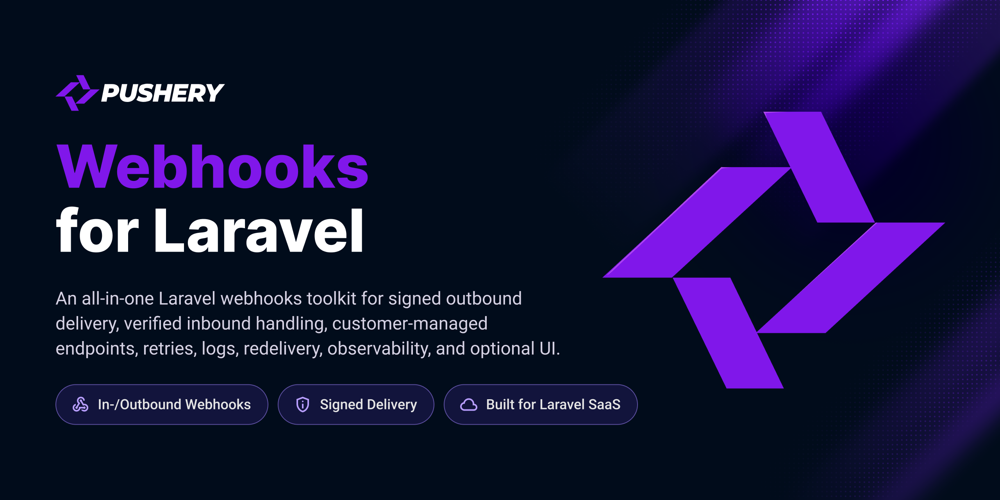

<p align="center">
  <a href="https://github.com/pushery/webhooks-for-laravel">
    
  </a>
</p>

# Webhooks for Laravel

[](https://packagist.org/packages/pushery/webhooks-for-laravel)
[](https://packagist.org/packages/pushery/webhooks-for-laravel)
[](https://phpstan.org)
[](https://laravel.com/docs/pint)
[](LICENSE)

An all-in-one, config-gated webhooks toolkit for Laravel. It **sends** signed
outbound webhooks, **receives** and verifies inbound ones, gives your customers a
**self-service** portal to manage their own endpoints, and puts an **observability**
dashboard over the whole delivery log — and you switch on only the layers you need.
Signatures are [Standard Webhooks](https://www.standardwebhooks.com) by default, so
every delivery is verifiable out of the box by any Standard Webhooks consumer in any
language. The engine is entirely in-house — no third-party webhook-engine
dependency — and its storage runs on **PostgreSQL or MySQL 8.4+** (or on no database
at all, if you only send).

```bash
composer require pushery/webhooks-for-laravel
```

## Documentation

**Full documentation lives at [docs.pushery.com/webhooks-for-laravel](https://docs.pushery.com/webhooks-for-laravel/).**

- [Installation](https://docs.pushery.com/webhooks-for-laravel/installation) — requirements, the per-layer publish tags, and the packages the UI needs
- [Quickstart](https://docs.pushery.com/webhooks-for-laravel/quickstart) — send a signed webhook, receive and verify one, or run send-only with no database
- [Choosing your database](https://docs.pushery.com/webhooks-for-laravel/choosing-your-database) — the three topologies, and what PostgreSQL buys over MySQL
- [The layers](https://docs.pushery.com/webhooks-for-laravel/layers) — sending, receiving, subscriptions and fan-out, the portal, the dashboard, the operator console
- [Signatures and interop](https://docs.pushery.com/webhooks-for-laravel/signatures-and-interop) — the wire format, every shipped scheme, and the published known-answer vectors
- [Configuration reference](https://docs.pushery.com/webhooks-for-laravel/reference/configuration) — every section, gate and default

## What you get

- **Sending** — an immutable, fluent `PendingWebhook` builder: signed and queued,
  exponential backoff with full jitter, `Retry-After` honored off the retry budget,
  per-call timeouts, mutual TLS, secret rotation and Horizon tags.
- **Receiving** — verify, throttle, de-duplicate, store and dispatch, with the exact
  received bytes preserved. Adapters ship for Standard Webhooks, Stripe, GitHub and
  plain HMAC, plus a seam for providers that authenticate without a signature at all.
- **Subscriptions and fan-out** — register endpoints per event type, fan an event out
  to every matching subscription, with an optional event catalog, JSON Schema payload
  validation and prefix wildcards.
- **A self-service portal** — real, full-page screens where a customer manages its own
  endpoints, rotates its signing secret and inspects endpoint health.
- **An observability dashboard** — KPI cards, latency percentiles, a server-rendered
  activity chart, a filterable delivery table with one-click redelivery, and an
  optional JSON metrics endpoint.
- **Reliability** — a circuit breaker that auto-disables a dead endpoint, traffic-shaping
  rate limits, and retention that drops a partition on PostgreSQL and runs a chunked,
  indexed delete on MySQL.
- **Security by default** — every outbound URL is SSRF-vetted and the connection pinned
  to the validated IP, secrets are encrypted at rest, and sensitive inbound headers are
  redacted before storage.
- **Seven languages** — every string the shipped UI renders is translated, and the
  translations are publishable.

Each layer has a single switch, so you pay only for what you turn on. A send-only app
runs no migrations at all and needs no database.

## Requirements

- PHP 8.4+ with `ext-curl`, `ext-json`, `ext-sodium`
- Laravel 13+
- PostgreSQL 13+ or MySQL 8.4+ — for the layers that persist
- A queue worker for outbound delivery
- `livewire/livewire` and `pushery/wirekit` for the shipped UI screens

## Security

Report vulnerabilities privately, per the [security policy](SECURITY.md).

## Built by Pushery

This package is built and maintained by [Pushery](https://www.pushery.com) — a
Berlin-based studio building Laravel applications, SaaS products, and open-source
tools.

Building a Laravel UI? [WireKit](https://wirekit.app), Pushery's open-source
Livewire component kit, gives you a polished component library out of the box.
Browse the rest of our work at [pushery.com](https://www.pushery.com).

## License

The MIT License (MIT). See [LICENSE](LICENSE) for details.
